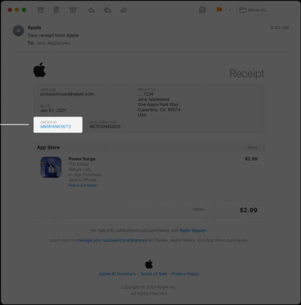

# appstore

提供以下 API:
- app store server api
- app store connect api

> 注意两者的 API key 是需要单独创建的

## app store server api
文档：https://developer.apple.com/documentation/appstoreserverapi

**已完成的 API**
- GetTransactionHistory
- GetTransactionInfo
- GetAllSubscriptionStatuses
- LookupOrder

> 以上方法的调用，请参考相应方法的 test

## QA

1. api key 如何创建?          
https://developer.apple.com/documentation/appstoreserverapi/creating_api_keys_to_use_with_the_app_store_server_api

注意 API 密钥只能下载一次，请立即保存   

2. `LookupOrder` 方法需要的 `customerOrderID` 从哪里获取？ 

Apple 给的说明如下：   
When customers make one or more in-app purchases in your app, the App Store emails them a receipt. The receipt contains an order ID. Use this order ID to call Look Up Order ID. Customers can also retrieve their order IDs from their purchase history on the App Store;

其实就是这个东西，用户反馈时候，让用户提供就可以了   

## JWS 如何验证

文档：https://developer.apple.com/documentation/appstoreserverapi/jwsdecodedheader

