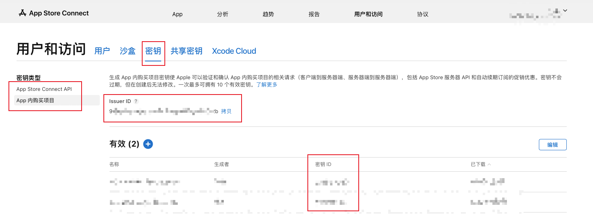
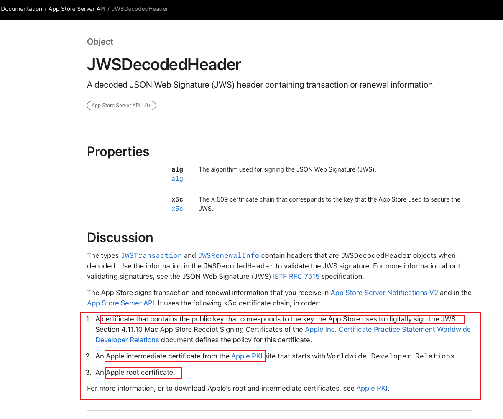
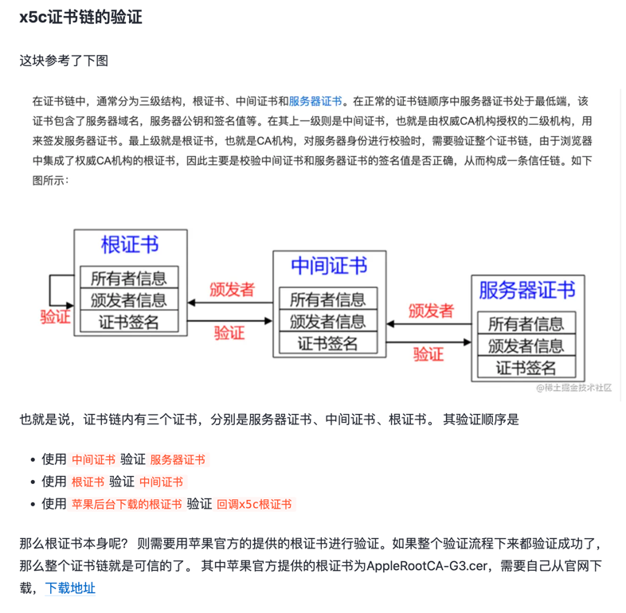

# appstore

提供以下 API:
- app store server api
- app store connect api

> 注意两者的 API key 是需要单独创建的

## app store server api
文档：https://developer.apple.com/documentation/appstoreserverapi

**已完成的 API**
- GetTransactionHistory
- GetTransactionInfo
- GetAllSubscriptionStatuses
- LookupOrder

**api key 如何创建？**  
https://developer.apple.com/documentation/appstoreserverapi/creating_api_keys_to_use_with_the_app_store_server_api

注意 API 密钥只能下载一次，请立即保存   

## JWS 如何验证

文档：https://developer.apple.com/documentation/appstoreserverapi/jwsdecodedheader

