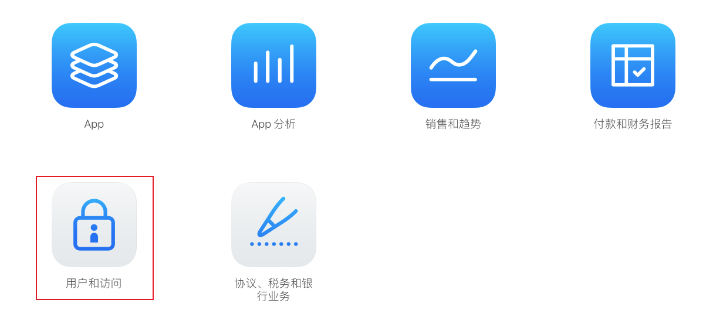
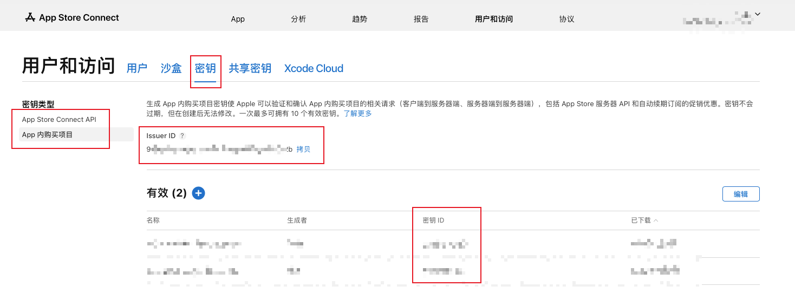
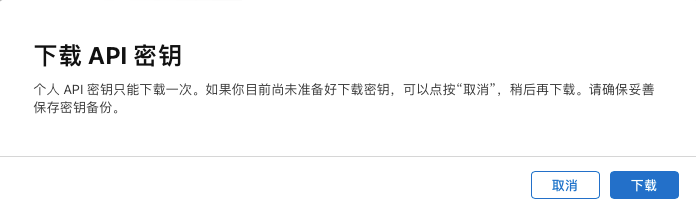
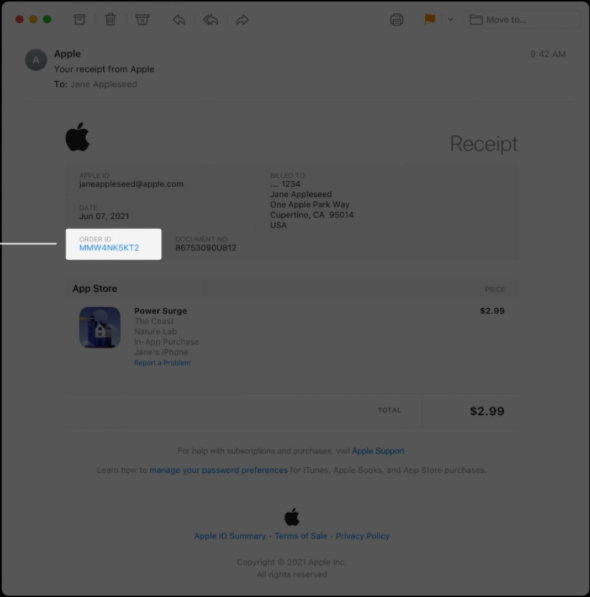
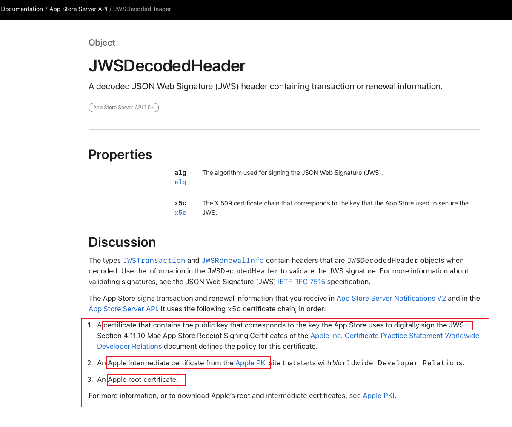
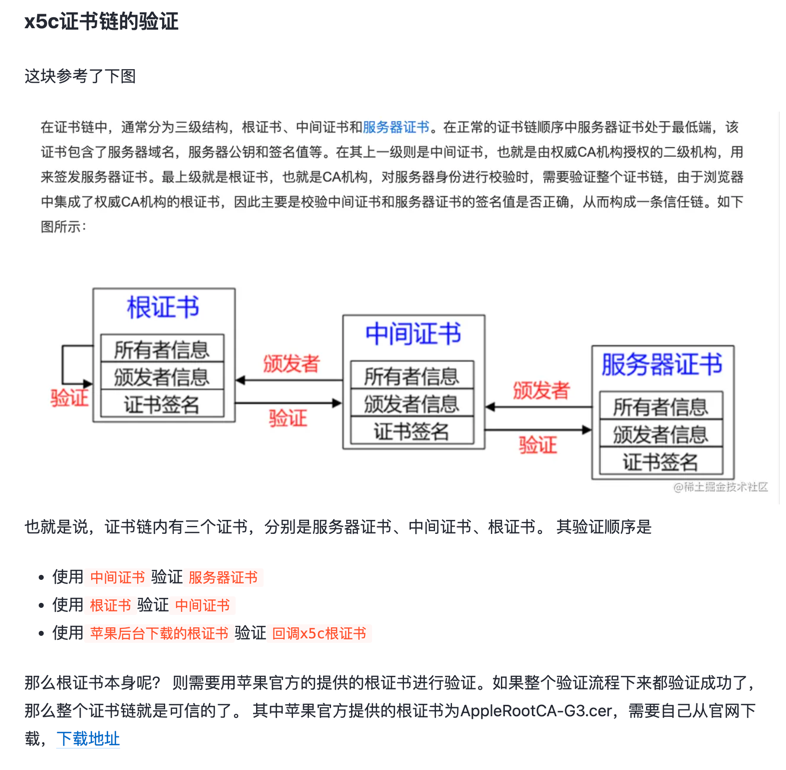

## app store server api
文档：https://developer.apple.com/documentation/appstoreserverapi

**已完成的 API**

| API | 说明                          |
| :--- |:----------------------------|
|LookupOrder| 根据用户订单ID，查询用户的内购交易信息        |
|GetTransactionInfo| 根据订单交易ID，查询用户的交易信息          |
|GetTransactionHistory| 根据订单交易ID，查询用户的所有交易记录        |
|GetAllSubscriptionStatuses| 根据订阅交易ID，查询用户的所有订阅数据        |
|GetRefundHistory| 根据交易ID，查询用户的所有退款交易        |
|GetNotificationHistory| 查询 app store 的消息通知历史记录      |
|RequestTestNotification| 请求 app store 通知服务发送一个测试通知   |
|GetTestNotificationStatus| 根据请求测试通知返回的测试token，查询测试通知数据 |

> 以上方法的调用，请参考相应方法的 test

## QA

1. api key 如何创建?          
   https://developer.apple.com/documentation/appstoreserverapi/creating_api_keys_to_use_with_the_app_store_server_api

登陆 app store connect 后台 (http://appstoreconnect.apple.com)

注意 API 密钥只能下载一次，请立即保存       

2. `LookupOrder` 方法需要的 `customerOrderID` 从哪里获取？

Apple 给的说明如下：       
When customers make one or more in-app purchases in your app, the App Store emails them a receipt. The receipt contains an order ID. Use this order ID to call Look Up Order ID. Customers can also retrieve their order IDs from their purchase history on the App Store;

其实就是这个东西，用户反馈时候，让用户提供就可以了       

## JWS 如何验证

文档：https://developer.apple.com/documentation/appstoreserverapi/jwsdecodedheader

x5c 证书链的验证

### 参考文章
- https://cloud.tencent.com/developer/article/1836878
- https://juejin.cn/post/7221542464843055160